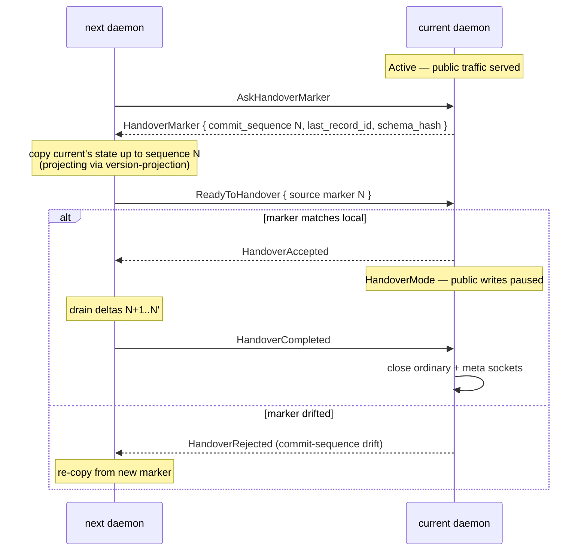
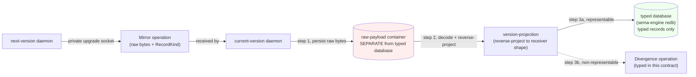
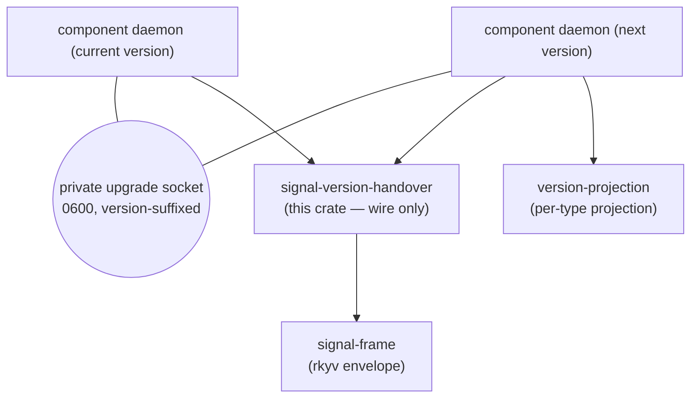

# signal-version-handover — architecture

*Private upgrade contract carrying the daemon-to-daemon handover
protocol between two versions of one component.*

## TL;DR

`signal-version-handover` is a signal contract crate. It owns the typed
wire vocabulary for the protocol two sibling daemons run to hand the
public surface from one version of a component to its next version
without losing writes. The contract is carried over a per-daemon
private upgrade socket (one socket per version, mode `0600`, version
suffix in the path). Six operations cover marker discovery, readiness,
finalization, mirrored writes, divergence recording, and recovery from
failure. `MirrorPayload` carries an **unspecified raw payload**;
receivers store the raw bytes in a separate container outside the
typed database, then reverse-project into typed records via
`version-projection`. The crate is pure wire vocabulary — no daemon
code, no runtime state machine, no migration logic.

## Components

| Piece | Owner |
|---|---|
| Channel macro instantiation (`VersionHandover`) | `src/lib.rs` |
| Six operation request types | `src/lib.rs` |
| Seven reply types | `src/lib.rs` |
| `HandoverMarker`, `HandoverAcceptance`, `HandoverFinalization` | `src/lib.rs` |
| `MirrorPayload`, `MirrorAcknowledgement` | `src/lib.rs` |
| `DivergencePayload`, `DivergenceAcknowledgement` | `src/lib.rs` |
| `HandoverRejection`, `HandoverRejectionReason` | `src/lib.rs` |
| `RecoveryRequest`, `RecoveryResult` | `src/lib.rs` |

## Protocol shape

The protocol models six operations carried over the private upgrade
socket of two sibling daemons (current version ↔ next version):

| Operation | Direction | Purpose |
|---|---|---|
| `AskHandoverMarker` | next → current | next asks current for the schema hash + commit sequence + last record id |
| `ReadyToHandover` | next → current | next tells current it has copied state up to a recorded marker |
| `HandoverCompleted` | next -> current | next confirms public traffic has moved; current closes ordinary and meta sockets |
| `Mirror` | next → current | next forwards a write back to current's database via reverse projection |
| `Divergence` | next → current | next records a write that reverse projection cannot represent |
| `RecoverFromFailure` | either | reconciliation after a failed transition |

Accepted replies stay small and typed. `HandoverMarker` carries the
shape next needs to verify durability — `ContractVersion` schema hash,
sema-engine `commit_sequence`, write counter, last record id, and
daemon-stamped capture date/time. Rejection detail lives in
`HandoverRejectionReason`.



## Wire vocabulary

```rust
signal_channel! {
    channel VersionHandover {
        operation AskHandoverMarker(MarkerRequest),
        operation ReadyToHandover(ReadinessReport),
        operation HandoverCompleted(CompletionReport),
        operation Mirror(MirrorPayload),
        operation Divergence(DivergencePayload),
        operation RecoverFromFailure(RecoveryRequest),
    }
    reply Reply {
        HandoverMarkerReported(HandoverMarker),
        HandoverAccepted(HandoverAcceptance),
        HandoverFinalized(HandoverFinalization),
        Mirrored(MirrorAcknowledgement),
        DivergenceRecorded(DivergenceAcknowledgement),
        Recovered(RecoveryResult),
        HandoverRejected(HandoverRejection),
    }
}
```

`HandoverMarker` carries the load-bearing durability shape — schema
hash, sema-engine commit sequence, write counter, last record id,
daemon-stamped date/time. `MirrorPayload` carries an **unspecified
raw payload** — raw bytes plus a `RecordKind` discriminant; the
wire remains version-pair-blind and receiver daemons decode through the
appropriate versioned contract library.

## Mirror payload — raw bytes in a separate container

`MirrorPayload` carries raw bytes whose type signature is
**"unspecified raw payload"**. The contract here owns only the wire
shape; the receiving daemon owns the storage discipline. That
discipline has one load-bearing rule:

**Raw payload bytes MUST land in a SEPARATE container outside the
receiver's typed database.** The typed database (e.g. the receiver's
sema-engine-managed redb) only ever accepts records that have already
been reverse-projected through `version-projection` into the
receiver's own typed shape. Un-incorporated bytes never pollute the
typed database — they live in a raw-bytes side container until
projection runs.



Container scope is open — per-component-version-pair or
per-handover-session both fit the rule. Receivers MAY choose either
granularity; the contract here is indifferent so long as the
separation from the typed database is maintained. Implementations
should record the choice in the receiver daemon's ARCHITECTURE.

The receiver-side handler unpacks the raw bytes during the handover
window, applies reverse-projection through `version-projection`, then
writes the resulting typed records to the typed database. A
non-representable payload becomes a typed `Divergence` operation on
this wire — never a silent drop and never a raw row in the typed
database.

This discipline keeps two invariants together:
- the contract crate stays version-pair-blind (no signal-X-per-pair
  variants leak in)
- the typed database stays clean (no untyped material accumulates,
  even transiently)

## Boundary



Wire-only crate. Runtime state machines live in component daemons or
in `sema-upgrade`'s handover prototype. Schema projection logic lives
in `version-projection`. Component-specific record transforms live in
the component runtime crate's per-version migration module.

The wire is carried over a per-version private upgrade socket. Naming
discipline: handwritten version-string suffix
(`<component>-upgrade.sock` inside a `v<X>.<Y>.<Z>/` subdirectory),
not hash-of-schema. Permissions are 0600; both daemons run under the
same UID (the persona-owner identity).

## Constraints

- The crate is a signal contract; it owns only typed wire vocabulary.
- The crate ships no daemon binary, no socket binding, no runtime
  state machine.
- The crate does not depend on `version-projection` at the trait
  level; daemons that compose the two import both.
- The crate does not depend on any `signal-persona-*` contract.
- `HandoverMarker` carries `ContractVersion`, `commit_sequence`,
  `write_counter`, `last_record_id`, and daemon-stamped capture
  date/time.
- Operations and replies round-trip through rkyv and NOTA inside
  `tests/`.
- The crate does not own administrative authority verbs
  (force-flip / rollback / quarantine) — those belong to
  `meta-signal-version-handover`.
- `MirrorPayload` carries an unspecified raw payload (raw bytes plus
  a `RecordKind` discriminant). The contract does not type the
  payload per version pair; the receiver decodes via the appropriate
  signal-X library and applies reverse-projection through
  `version-projection`.
- Receiver-side storage discipline: raw bytes land in a SEPARATE
  container outside the receiver's typed database. Only records
  produced by reverse-projection enter the typed database. The
  contract does not own the container's on-disk shape, but it does
  require the separation.

## Non-Goals

- No atomic-write magic across daemons. The wire records expose the
  pieces an atomic-or-compensating state machine needs; the state
  machine itself lives in daemons or in `sema-upgrade::handover`.
- No traffic-flip decision. Selector flip is the orchestrator's
  responsibility, not encoded in this contract.
- No write-freeze enforcement. The current daemon enters
  HandoverMode based on its own state machine, not a wire flag.
- No divergence reconciliation policy — recorded divergences land in
  persona-introspect; reconciliation is downstream tooling.

## Possible features

*Items here are under consideration, not committed. Each names the
open question; moves to the cemented body when settled; retires when
ruled out.*

- **Read-during-handover semantics on the contract surface.** Today
  the wire only models writes (Mirror + Divergence). Reads during
  HandoverMode are handled by the daemon's own ordinary contract;
  whether the wire here grows read-projection operations is open.

## Code Map

```text
src/lib.rs           channel macro instantiation, all operation/reply types, payload structs
Cargo.toml           dependency on signal-frame for rkyv envelopes
tests/               rkyv and NOTA round-trip witnesses for every operation and reply
```

## See also

- `../version-projection/ARCHITECTURE.md` — companion library carrying
  the projection trait and per-operation policy vocabulary.
- `../sema-upgrade/ARCHITECTURE.md` — handover prototype state machine
  driven by this contract.
- `../persona-spirit/ARCHITECTURE.md` — first production daemon owning
  a private upgrade socket that speaks this contract.
- `../sema-engine/ARCHITECTURE.md` — owner of `CommitSequence` carried
  in `HandoverMarker`.
